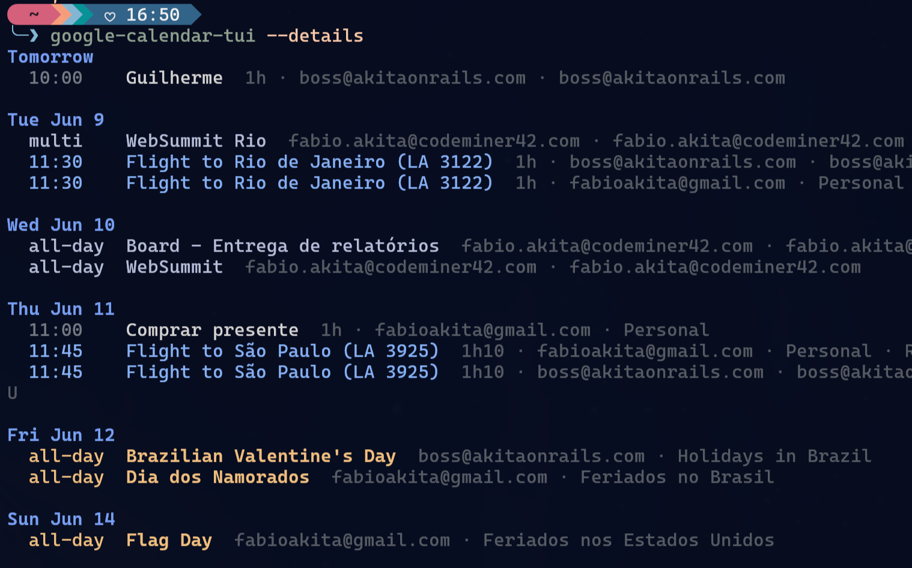

# google-calendar-tui

A quiet, read-only terminal agenda for Google Calendar using **GNOME Online Accounts**.

It fetches upcoming appointments once, prints them to stdout, and exits. It does not poll in the background. An optional interactive TUI can render only what fits in the terminal and reveal more with `m`.



## Features

- Uses your existing Google accounts from GNOME Online Accounts.
- No app-specific OAuth client setup or token cache.
- Read-only Google Calendar API access.
- One or more GOA Google accounts.
- Optional read-only private iCal/ICS sources for headless or non-GNOME environments.
- Colored plain stdout output by default for quick shell use; choose `default`, `evangelion`, or `nerv` with `--theme`, and disable stdout ANSI colors with `--no-color`.
- Optional responsive Ratatui UI with screen-fitting `more` behavior.
- Minimal default rows: day, time, and appointment title only.
- Subtle category color markers in TUI mode for holidays, birthdays, travel, focus time, out-of-office, meetings, and all-day events.
- Matching category colors in stdout mode for holidays, birthdays, travel, focus time, out-of-office, meetings, and all-day events.
- Optional `--details` mode for duration, video, account, calendar, and location columns.
- Fetches up to 60 days ahead by default; override with `--fetch-days`.
- Duplicate event suppression across calendars/accounts.
- Strips terminal control sequences from Google/GOA display text before printing or rendering.

## Setup

### Arch Linux

Install from AUR:

```sh
yay -S google-calendar-tui-bin      # prebuilt binary from GitHub Releases
yay -S google-calendar-tui          # builds from source
```

### From source

Requires Rust 1.88 or newer.

```sh
cargo install --git https://github.com/akitaonrails/google-calendar-tui
```

### GNOME account

Add your Google account in GNOME:

```text
GNOME Settings > Online Accounts > Google
```

Make sure Calendar is enabled for that account.

Then run:

```sh
google-calendar-tui
```

When developing from a checkout, use `cargo run` instead.

Default output is colored stdout:

```text
Today
  09:00    Standup
  all-day  Some holiday

Tomorrow
  14:00    Dentist
```

## Accounts

List Google Calendar accounts known to GOA:

```sh
cargo run -- --list-accounts
```

Use all accounts by default, or filter by email/display/id:

```sh
cargo run -- --account personal@example.com
cargo run -- --account personal@example.com --account work@example.com
cargo run -- --account personal,work
```

Show extra source/details columns:

```sh
cargo run -- --details
```

Disable ANSI colors in stdout mode:

```sh
cargo run -- --no-color
NO_COLOR=1 cargo run --
```

Use the interactive TUI with screen-fitting `more` behavior:

```sh
cargo run -- --tui
```

## Headless / WSL / non-GNOME calendars

GOA remains the default. For environments without GNOME Online Accounts, pass one or more private iCal/ICS URLs explicitly:

```sh
cargo run -- --ics 'https://calendar.google.com/calendar/ical/.../basic.ics'
cargo run -- --ics 'https://calendar.google.com/calendar/ical/.../basic.ics' --ics 'https://example.com/other.ics'
cargo run -- --ics 'https://calendar.google.com/calendar/ical/.../basic.ics' --tui
```

Use Google Calendar's **Secret address in iCal format** for each calendar you want to include. Each URL grants bearer read access to that calendar: do not share it, and remember that passing it on the command line may store it in shell history or expose it briefly in process listings. If it leaks, reset the secret address in Google Calendar settings.

When `--ics` is present, the app skips GOA completely. `--ics` cannot be combined with GOA-only options such as `--list-accounts`, `--account`, or `--all-calendars`.

ICS parsing supports timed events, all-day events, and bounded RRULE/RDATE/EXDATE recurrence expansion. Floating datetimes are interpreted in the local timezone; custom non-IANA `VTIMEZONE` definitions and modified recurring instances may not preserve every Google Calendar API detail.

## TUI commands

Inside `--tui` mode:

- `q` / Esc: quit
- `m` / Space / Down: more, when hidden appointments remain
- `0` / Home: return to the first page after using more

## Colors and themes

In stdout mode, appointment rows are colored by category. In `--tui` mode, each appointment row gets a small colored marker and titles stay mostly neutral to avoid visual noise. The selected theme applies to both stdout ANSI colors and TUI colors.

Available themes:

- `default`: the original muted terminal palette.
- `evangelion`: purple/lavender, orange, and bright green inspired by the classic Evangelion terminal look.
- `nerv`: orange/amber headers with neon green accents and red out-of-office/urgent markers.

`--no-color` and the `NO_COLOR` environment variable disable ANSI colors only in plain stdout mode. TUI colors still use the selected theme.

Default category mapping:

- amber: holidays
- violet: birthdays
- blue: travel
- green: focus time
- red: out-of-office / vacation
- soft blue: meetings with video links
- slate: all-day events

Holiday detection uses Google holiday calendar IDs/names plus common holiday terms, including `holiday`, `feriado`, and `festivo`.

## Options

Usage:

```text
google-calendar-tui [OPTIONS]
```

| Option | Description |
| --- | --- |
| `-a, --account <ACCOUNT>` | Filter GOA accounts by exact id, email, display name, or object path. If there is no exact match, a case-insensitive substring match is used. Repeat the flag or comma-separate values, for example `--account personal@example.com --account work@example.com` or `--account personal,work`. |
| `--list-accounts` | List usable Google Calendar accounts known to GNOME Online Accounts and exit without fetching events. Respects `--account` filters. |
| `--all-calendars` | Include calendars that are hidden or unselected in Google Calendar. Without this flag, only primary and selected calendars are read. Free/busy-only calendars are still skipped. |
| `--ics <URL>` | Fetch events from a private iCal/ICS URL instead of GOA. Repeat for multiple calendars. Conflicts with `--list-accounts`, `--account`, and `--all-calendars`. Treat URLs as secrets. |
| `--details` | Show extra columns after the title: duration, `Meet` when a video link is detected, GOA account, calendar name, and location when present. |
| `--tui` | Use the interactive Ratatui screen-fitting view instead of plain stdout. In TUI mode, `m`, Space, or Down reveals more hidden appointments; `0` or Home returns to the top; `q` or Esc quits. |
| `--theme <THEME>` | Color theme for stdout ANSI and TUI rendering. Allowed values: `default`, `evangelion`, `nerv`. Default: `default`. |
| `--no-color` | Disable ANSI colors in plain stdout mode. The `NO_COLOR` environment variable also disables stdout colors. TUI colors still use `--theme`. |
| `--fetch-days <DAYS>` | Number of future days to fetch once at startup. Default: `60`. Values below `1` are clamped to `1`. |
| `--max-results-per-calendar <N>` | Maximum events requested per calendar page. Default: `2500`. Values are clamped to Google Calendar's API range of `1..=2500`. |
| `-h, --help` | Print help and exit. |
| `-V, --version` | Print the package version and exit. |

## Notes

GOA returns short-lived access tokens over D-Bus. The app does not persist Google tokens. If GOA says the account needs attention, fix it in GNOME Settings and run the app again.

By default, only your primary and selected Google calendars are read. Use `--all-calendars` only when you also want calendars hidden/unselected in Google Calendar.

Private ICS mode is also read-only and fetches once, but it cannot list calendars or infer Google account metadata. Multiple calendars require multiple `--ics` flags.
